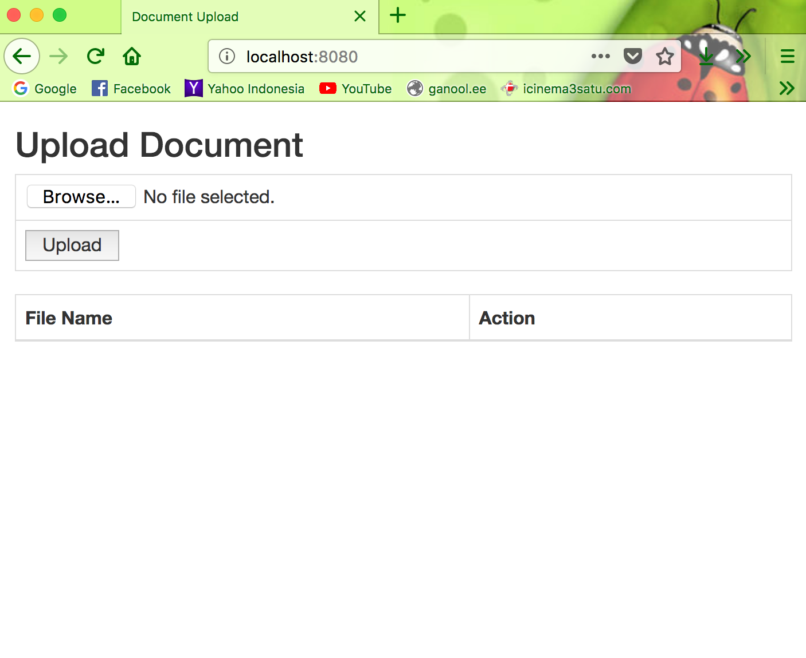
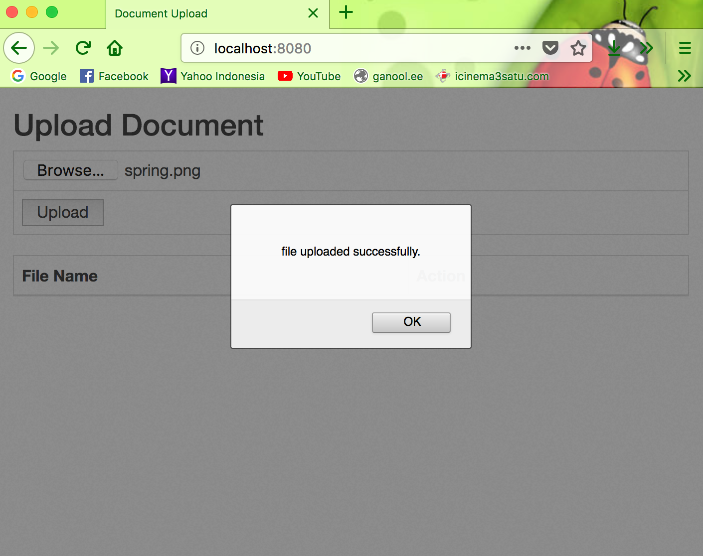
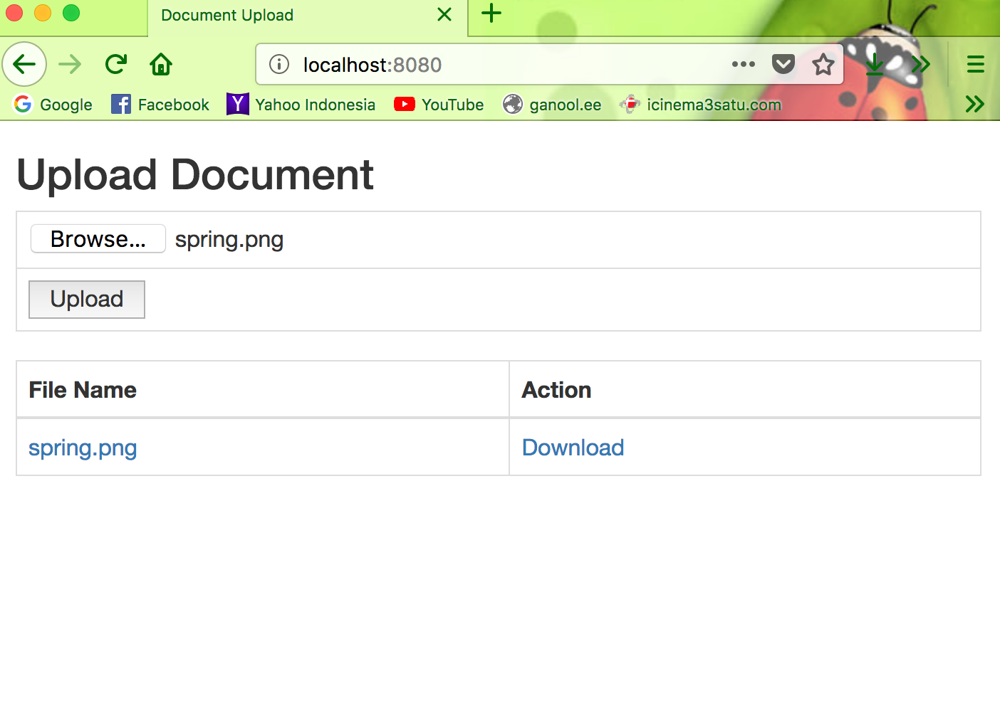

# Spring Boot Angular File Upload

#### This is just an example of using Spring Boot Angulat to Upload files

Run this by this command on your terminal :

`mvn clean spring-boot:run`

Open your browser : `http://localhost:8080/`

